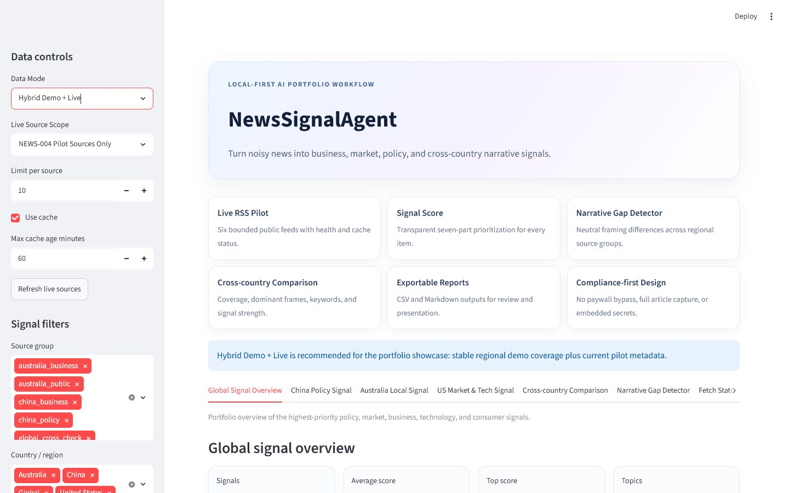
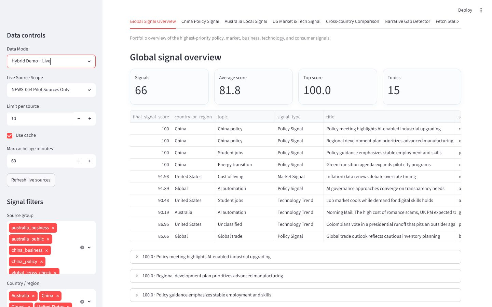
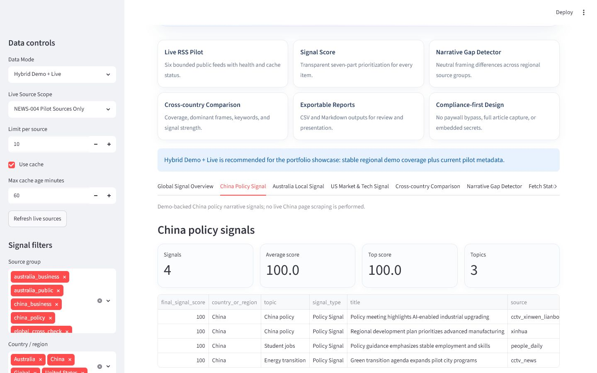
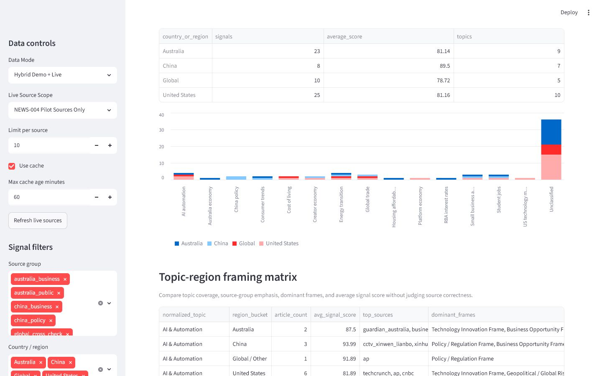
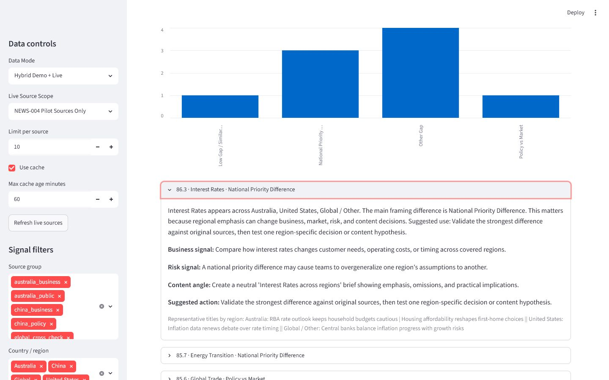
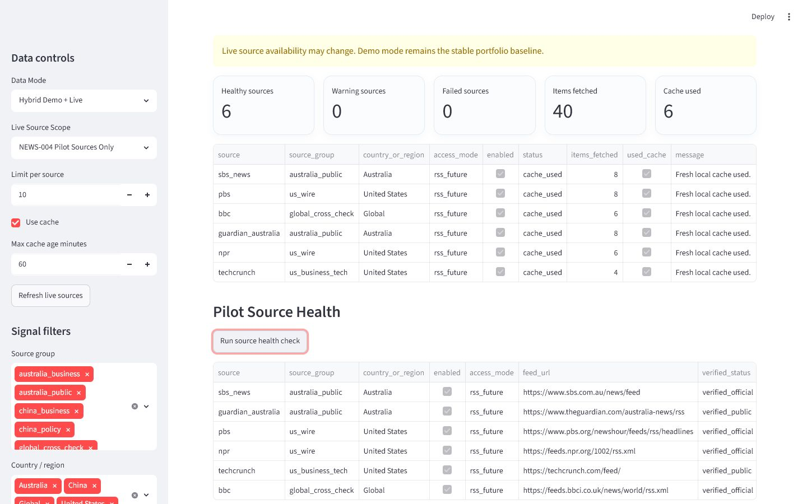
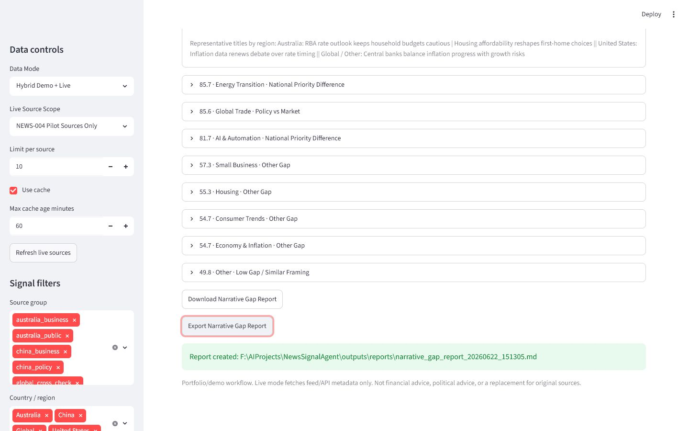

# NewsSignalAgent

> Turn noisy news into business, market, policy, and cross-country narrative signals.

NewsSignalAgent is a local-first AI workflow portfolio project. It demonstrates how a business-oriented agent can combine safe demo data, a bounded public RSS pilot, transparent prioritization, and neutral regional framing comparison without becoming a generic news summarizer.

## Why this project exists

News volume is abundant; decision context is not. A headline may signal regulation in one source group, consumer pressure in another, and a technology or investment opportunity elsewhere. NewsSignalAgent helps a user decide what deserves deeper research while keeping the assumptions, provenance, and limitations visible.

## Core workflow

```text
Configured sources + original demo data
                |
       Demo / Live / Hybrid loader
                |
    cleaning + title/URL deduplication
                |
 classification + seven-part Signal Score
                |
 topic-region matrix + Narrative Gap Detector
                |
 Streamlit dashboard + CSV/Markdown reports
```

## Features

- **Live RSS Pilot:** six bounded, locally verified public feeds with cache and health status
- **Signal Score:** explainable relevance, urgency, business, policy, confirmation, strength, and novelty components
- **Narrative Gap Detector:** neutral source-group emphasis comparison across four region buckets
- **Cross-country Comparison:** topic coverage, dominant frames, keywords, sources, and average scores
- **Exportable Reports:** signal CSV/Markdown, live status, and narrative gap reports
- **Compliance-first Design:** demo-first operation, attribution, capture policies, no paywall bypass, and no full-body scraping

## Dashboard screenshots

The screenshots below were captured from the real local Streamlit dashboard in NEWS-007 using Hybrid Demo + Live mode. See [the screenshot guide](docs/SCREENSHOTS_GUIDE.md) for the review and recapture process.










## Source architecture

Seven source groups represent different analytical roles:

- China policy and China business
- Australia public and Australia business
- US wire and US business/technology
- Global cross-check

The NEWS-004 pilot enables SBS News, Guardian Australia, PBS NewsHour, NPR News, TechCrunch, and BBC World. CCTV Xinwen Lianbo remains a disabled policy anchor because no stable official RSS was confirmed; the legacy Xinhua candidate returned HTTP 404. Source verification is time-bound rather than a permanent endorsement.

## Signal Score

Each article receives seven 0-100 components configured in YAML: relevance, urgency, business impact, policy narrative importance, cross-source confirmation, source strength, and novelty. Their weighted result is adjusted by transparent source-group/source multipliers and capped at 100.

The separate Narrative Gap Score combines regional coverage, dominant-frame diversity, average underlying signal strength, and practical implications. Neither score predicts outcomes.

## Narrative Gap Detector

The detector normalizes broad topics, assigns keyword-based frames, and compares emphasis across China, Australia, the United States, and Global/Other. It produces business signals, risks, content angles, suggested actions, and representative titles. It does **not** label sources as true, false, biased, or politically preferable.

## Data modes

- **Demo Data:** default, fully local, 26 original sample records, and the stable portfolio baseline
- **Live Sources:** enabled feeds only, with cache, attribution, and fetch status
- **Hybrid Demo + Live:** recommended showcase mode; combines stable regional demo coverage with the bounded pilot

Live-source availability may change. A failed source never prevents Demo mode from running.

## Tech stack

Python, Streamlit, pandas, PyYAML, feedparser, requests, truststore, and pytest.

## Run locally

```powershell
Set-Location F:\AIProjects\NewsSignalAgent
python -m venv .venv
.\.venv\Scripts\python.exe -m pip install --upgrade pip
.\.venv\Scripts\python.exe -m pip install -r requirements.txt
.\.venv\Scripts\python.exe -m pytest
.\.venv\Scripts\python.exe tools\public_release_check.py
.\.venv\Scripts\python.exe -m streamlit run app.py
```

Open `http://localhost:8501` unless Streamlit reports another local port.

## Tests and release checks

```powershell
python -m pytest
python -m compileall .
python tools/public_release_check.py
```

The safety script is read-only. It reports local secrets, generated cache/report/export files, and required showcase structure without deleting anything.

## Safety and compliance

- No API keys or private credentials are required or committed
- No paywall bypass, protected-page scraping, video download, or full article-body capture
- Live rows preserve source, region, URL, timestamps, verification status, and capture policy
- Generated cache, reports, exports, and logs are Git-ignored
- All demo summaries are original portfolio data
- Review [PUBLIC_RELEASE_CHECKLIST.md](docs/PUBLIC_RELEASE_CHECKLIST.md) before publishing

## Current limitations

- Topic and framing rules are mainly English-keyword based
- China live sources remain disabled; Demo data provides China comparison coverage
- The pilot is intentionally small and feed availability can change
- A dominant frame simplifies internal variation within a region
- Results support research prioritization, not forecasting or source-truth judgment

## Roadmap

- **Current:** NEWS-008 - GitHub public showcase published and verified
- **Status:** Project paused after public README, screenshot, metadata, and safety verification
- **Later:** optional schema-validated LLM analysis, evaluation datasets, watchlists, and trend history

## Disclaimer

NewsSignalAgent is a portfolio/demo workflow. It is not financial advice, political advice, personal investment advice, or a replacement for reading and verifying original sources.
